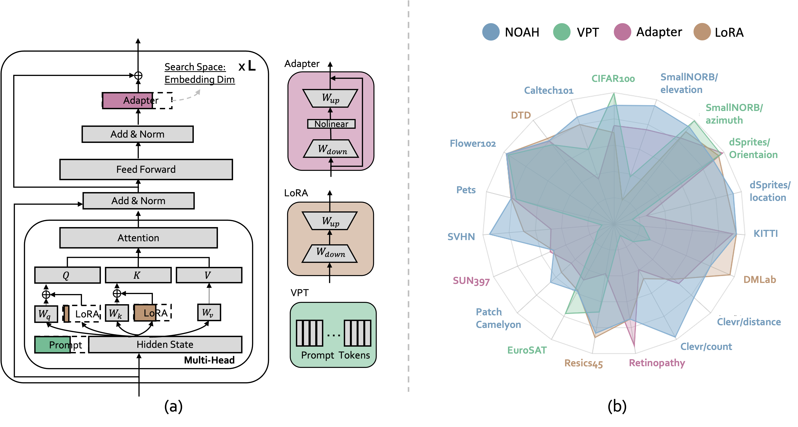
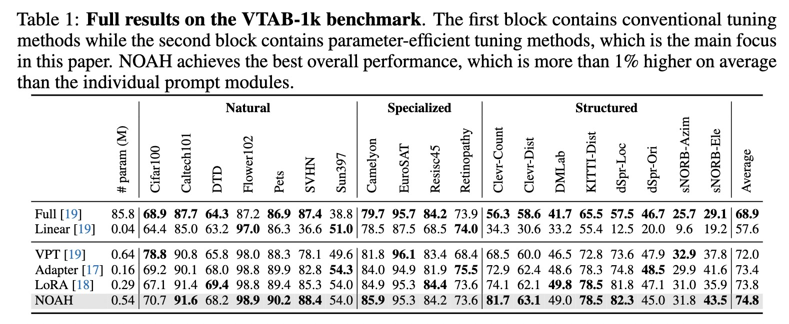

<div align="center">

<h1>Neural Prompt Search</h1>

<div>
    <a href='https://davidzhangyuanhan.github.io/' target='_blank'>Yuanhan Zhang</a>&emsp;
    <a href='https://kaiyangzhou.github.io/' target='_blank'>Kaiyang Zhou</a>&emsp;
    <a href='https://liuziwei7.github.io/' target='_blank'>Ziwei Liu</a>
</div>
<div>
    S-Lab, Nanyang Technological University
</div>





<h3>TL;DR</h3>

The idea is simple: we view existing parameter-efficient tuning modules, including [Adapter](https://arxiv.org/abs/1902.00751), [LoRA](https://arxiv.org/abs/2106.09685) and [VPT](https://arxiv.org/abs/2203.12119), as prompt modules and propose to search the optimal configuration via neural architecture search. Our approach is named **NOAH** (Neural prOmpt seArcH).

---

<p align="center">
  <a href="https://arxiv.org/abs/2206.04673" target='_blank'>[arXiv]</a>
</p>

</div>


## Updatas
[05/2022] [arXiv](https://arxiv.org/abs/2206.04673) paper has been **released**.

## Environment Setup
```
conda create -n NOAH python=3.8
conda activate NOAH
pip install -r requirements.txt
```

## Data Preparation

### 1. Visual Task Adaptation Benchmark (VTAB)
```
cd data/vtab-source
python get_vtab1k.py
```

### 2. Few-Shot and Domain Generation

- Images

    Please refer to [DATASETS.md](https://github.com/KaiyangZhou/CoOp/blob/main/DATASETS.md) to download the datasets.

- Train/Val/Test splits

    Please refer to files under `data/XXX/XXX/annotations` for the detail information.


## Quick Start For NOAH
We use the VTAB experiments as examples.

### 1. Downloading the Pre-trained Model
| Model | Link |
|-------|------|
|ViT B/16 | [link](https://storage.googleapis.com/vit_models/imagenet21k/ViT-B_16.npz)|

### 2. Supernet Training
```
sh configs/NOAH/VTAB/supernet/slurm_train_vtab.sh PATH-TO-YOUR-PRETRAINED-MODEL
```

### 3. Subnet Search
```
sh configs/NOAH/VTAB/search/slurm_search_vtab.sh PARAMETERS-LIMITES
```
### 4. Subnet Retraining
```
sh configs/NOAH/VTAB/subnet/slurm_retrain_vtab.sh PATH-TO-YOUR-PRETRAINED-MODEL
```
We add the optimal subnet architecture of each dataset in the ``experiments/NOAH/subnet/VTAB``.  

### 5. Performance


## Citation
If you use this code in your research, please kindly cite this work.
```
@inproceedings{zhang2022NOAH,
      title={Neural Prompt Search}, 
      author={Yuanhan Zhang and Kaiyang Zhou and Ziwei Liu},
      year={2022},
      archivePrefix={arXiv},
}
```

## Acknoledgments
Part of the code is borrowed from [CoOp](https://github.com/KaiyangZhou/CoOp), [AutoFormer](https://github.com/microsoft/Cream/tree/main/AutoFormer), [timm](https://github.com/rwightman/pytorch-image-models) and [mmcv](https://github.com/open-mmlab/mmcv).

Thanks Zhou Chong (https://chongzhou96.github.io/) for the code of downloading the VTAB-1k.

